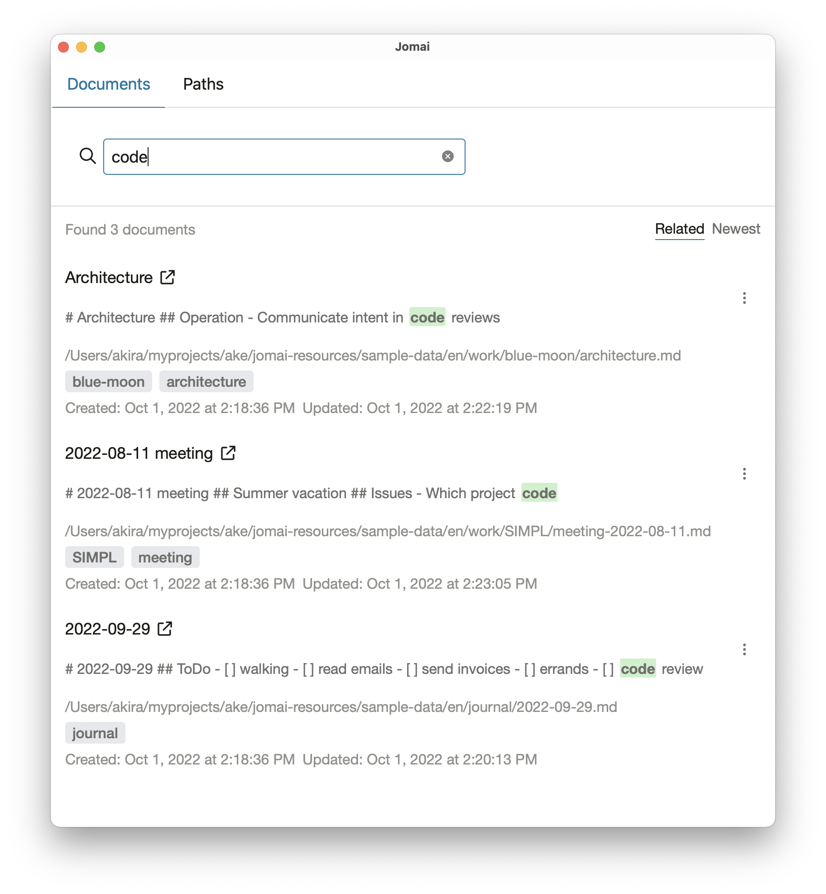

# Jomai

A desktop search system specialized for Markdown files written in Rust.

https://jomai.app/



## Supported Languages

- English
- Japanese
- Planned: more languages

## Setup Local Environment

### Setup Japanese Dictionary

```bash
just download-japanese-dictionary
```

### Install dependencies

```bash
cd app
pnpm install
````

### Run the app

```bash
pnpm tauri dev
```

## Update licenses.html

```bash
just generate-license-html
```

## Uninstall

1. Remove `${HOME}/Library/Application\ Support/app.jomai.jomai`.
2. Remove jomai.app from /Applications if you installed it there.

## License

MIT

## Third-party Licenses

See [licenses.html](licenses/licenses.html).
